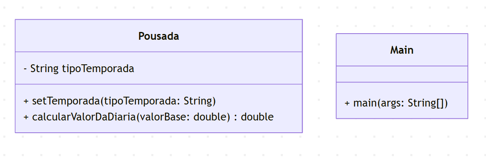

Esta implementação do antipadrão do comportamento Strategy foi desenvolvida como um exercício prático para aplicar os conceitos estudados na disciplina de Engenharia de Software 3.

    classDiagram
    class Pousada {
        -String tipoTemporada
        +setTemporada(tipoTemporada: String)
        +calcularValorDaDiaria(valorBase: double) double
    }

    class Main {
        +main(args: String[])
    }

