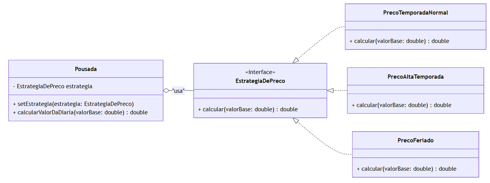

Esta implementação do padrão do comportamento Strategy foi desenvolvida como um exercício prático para aplicar os conceitos estudados na disciplina de Engenharia de Software 3.

classDiagram

    class EstrategiaDePreco {
        +calcular(valorBase: double) double
    }

    class PrecoTemporadaNormal {
        +calcular(valorBase: double) double
    }

    class PrecoAltaTemporada {
        +calcular(valorBase: double) double
    }

    class PrecoFeriado {
        +calcular(valorBase: double) double
    }
    
    class Pousada {
        - EstrategiaDePreco estrategia
        + setEstrategia(estrategia: EstrategiaDePreco)
        + calcularValorDaDiaria(valorBase: double) double
    }
